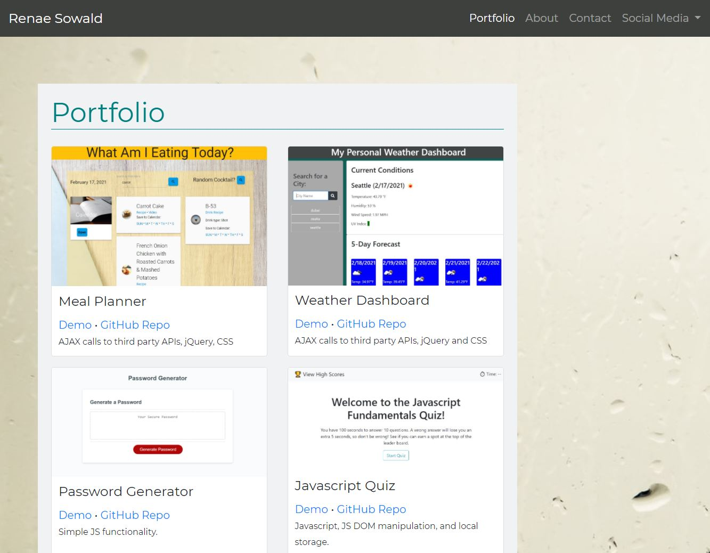
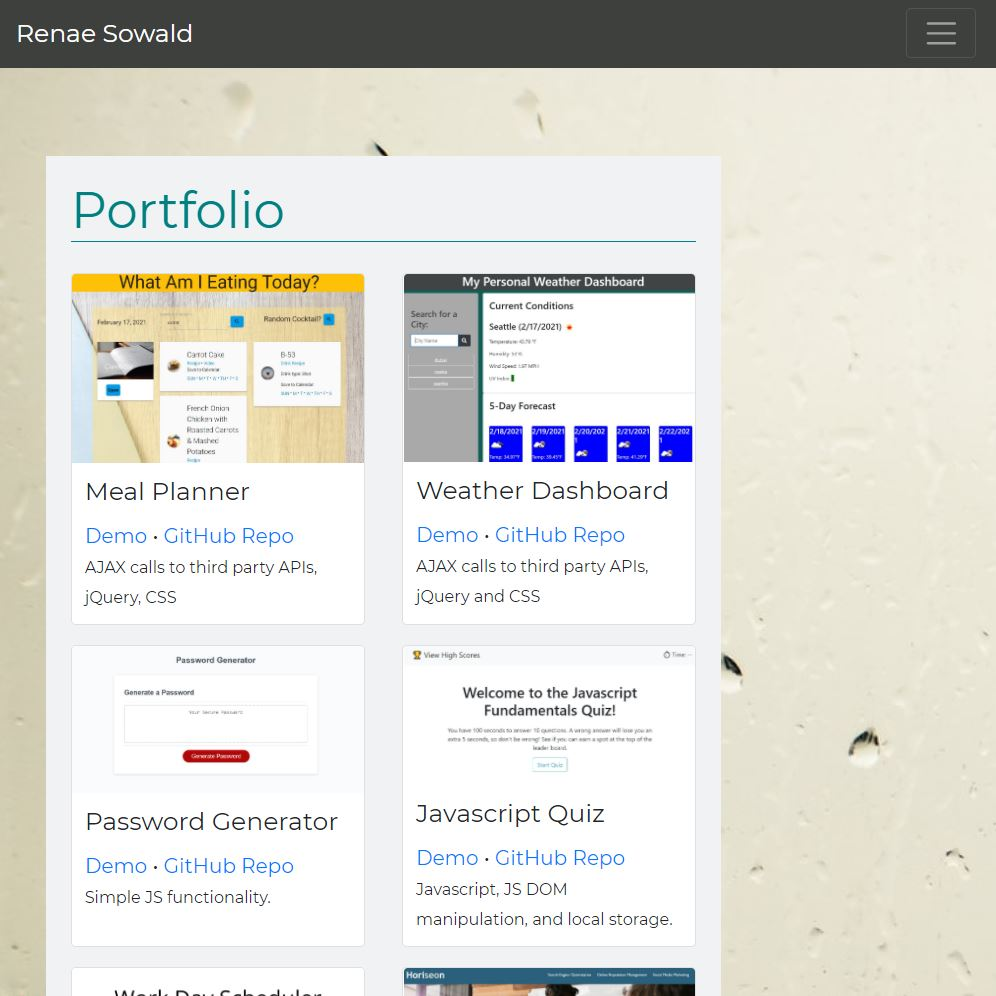
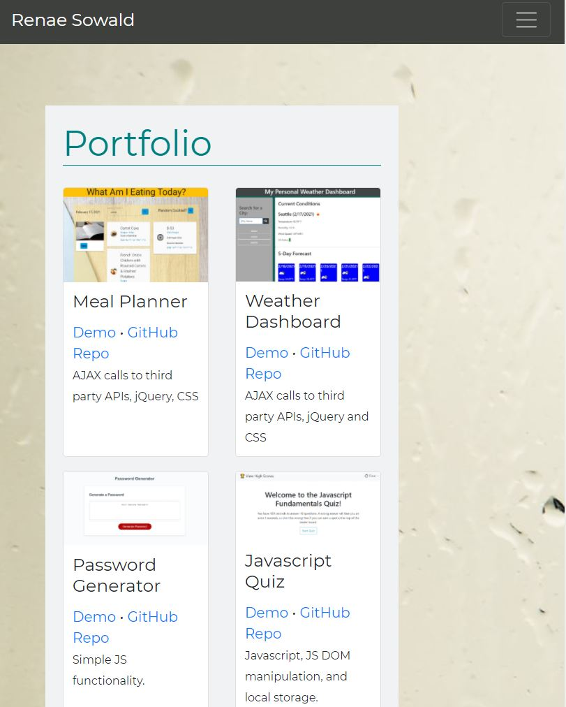
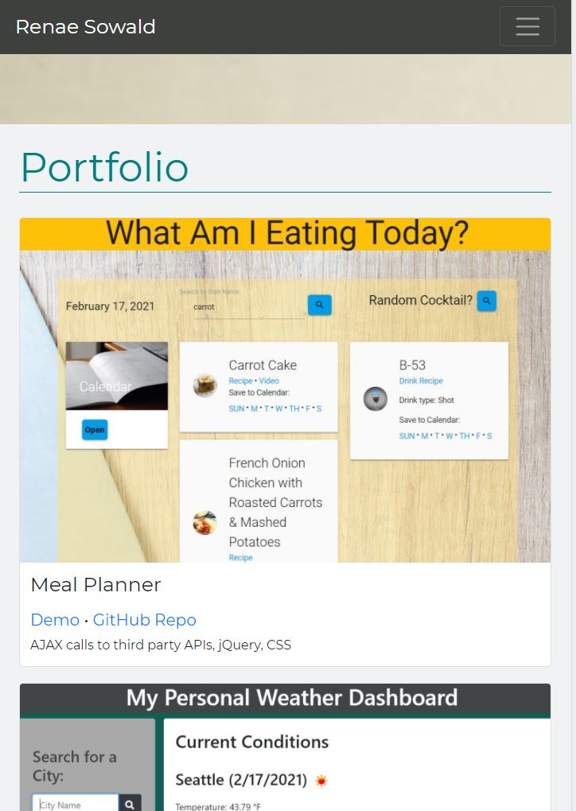

# ResponsivePortfolio

[View deployed application](https://rsowald.github.io/Renae_Sowald_Portfolio/)

## About the Project
The purpose of this project was to create a responsive professional portfolio using Bootstrap. In our modern digital world, optimizing applications for different resolutions and devices is imperative to their success. With more than 50% of web traffic being accessed from mobile devices, an application that is developed to look good only on a large resolution computer screen just does not make sense. While CSS makes it possible to develop a responsive application using media queries, floats on images, and extensive uses of classes on divs, it is much simpler to develop using Bootstrap.

Some of the Bootstrap components and utilities used are:
- Responsive containers with built-in media queries
- Grid layout with rows and columns to control size of containers and alignment
- Responsive nav bar with collapsible nav link menu
- Card to easily style a form
- Sticky footer

Even with the plethora of Bootstrap components, it is still necessary to include my own custom CSS styles. If every website that used Bootstrap relied only on the default styling, every website would look identical expect for content. My goal is always to make a unique application while still utilizing the power of a framework like Bootstrap.

This portfolio is also an opportunity for me to present my finished projects in a professional manner as a job search tool. As I learn more, I will not only add more project links, but also make the portfolio application more dynamic whenever a logical feature suggests itself.

## Examples

 

 

 

 

## Future Features
- I would like to use a templating engine to generate my views. This would be especially helpful with the portfolio cards and partials.
- I would like to set up a server and routes instead of hard coding all of my linked pages together.
## Acknowledgements
Background photo by Photo by <a href="https://unsplash.com/@tvick?utm_source=unsplash&amp;utm_medium=referral&amp;utm_content=creditCopyText">Taylor Vick</a> on <a href="https://unsplash.com/s/photos/seattle?utm_source=unsplash&amp;utm_medium=referral&amp;utm_content=creditCopyText">Unsplash</a>

Ohio State image by <a href="https://www.osu.edu/downloads/images.html"> The Ohio State University</a>

## Contact
Renae Sowald - renaesowald@gmail.com

## License
[MIT](LICENSE)
